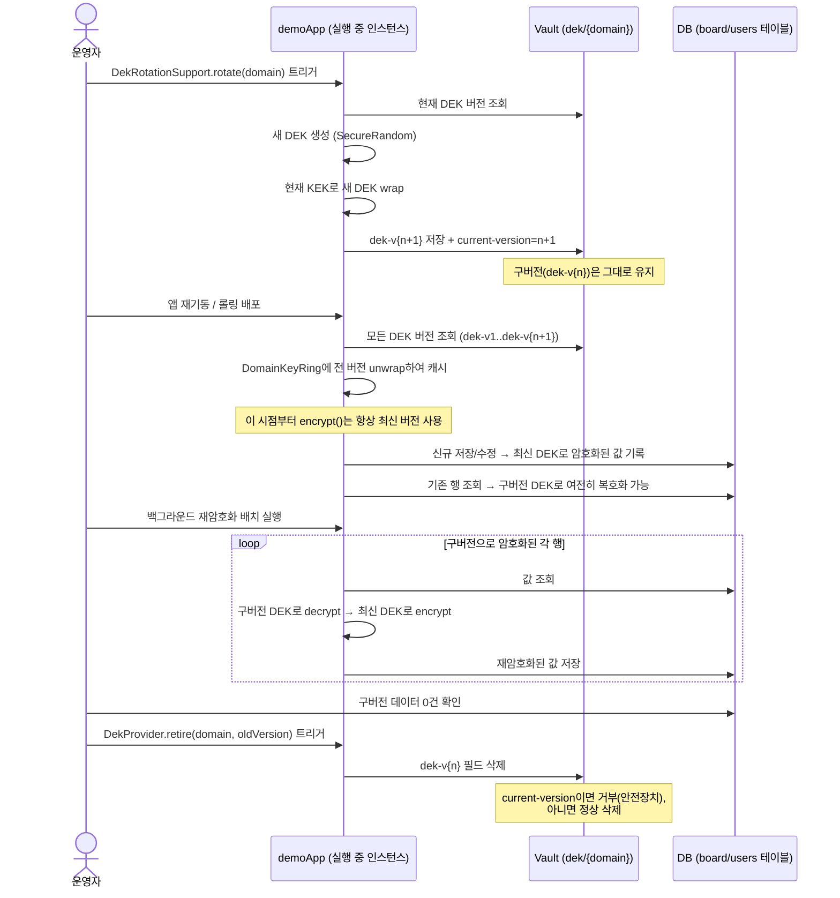
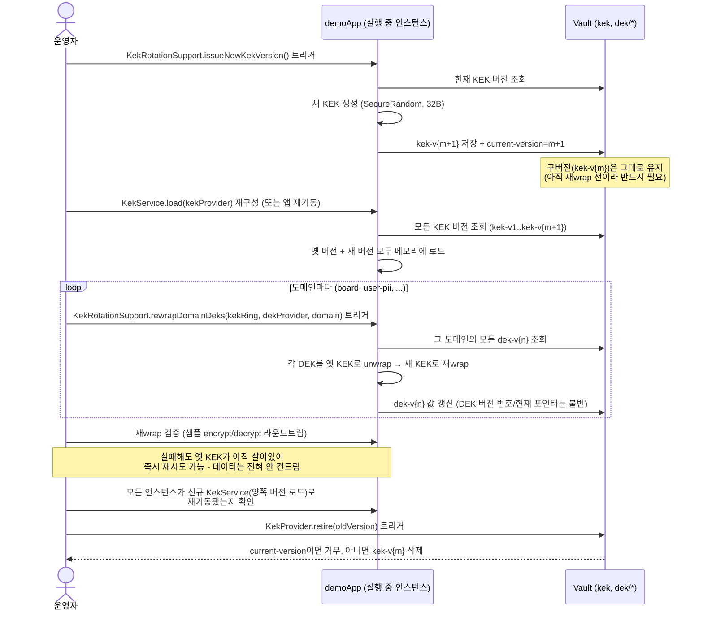

# KEK / DEK 키 로테이션 런북

`KEK_DEK_ENCRYPTION_PLAN.md`에서 설계한 KEK-DEK 봉투 암호화 모델(vault-crypto `0.0.7`, demoApp `0.0.9` 기준)에서, KEK와 DEK를 각각 실제로 교체(로테이션)할 때 따라야 할 절차를 정리한다. 코드 근거는 `vault-crypto`의 `com.xaan.vault.crypto.envelope` 패키지(`KekService`, `KekProvider`/`VaultKekProvider`, `KekRotationSupport`, `DekProvider`/`VaultDekProvider`, `DekRotationSupport`, `DomainKeyRing`, `EnvelopeCryptoService`)와 demoApp의 `DekOpsRunner`/`DekReencryptionService`/`dek_ops_batch.sh`/`dek_ops_batch.bat`(2026-08-20에 구현, 운영 환경에서 board/user-pii 두 도메인 모두 실제 검증 완료)다.

> **DEK 로테이션 절차는 2026-08-20에 운영 서버에서 실제로 실행해 검증했다** (아래 §2). 그 과정에서 발견/수정한 것들: (1) 레거시(구 단일 키) 포맷 행을 재암호화 실패로 잘못 집계하던 버그, (2) `dek_ops_batch.bat`가 ssh로 빈 문자열 인자를 넘길 때 뒤 인자가 앞으로 밀리며 `reencrypt`가 `rotate`로 둔갑하던 버그(`-` sentinel로 해결), (3) **rotate와 reencrypt를 같은 실행에서 함께 하면 안 된다는 것** — 아래 경고 참고. KEK 로테이션(§3)은 아직 실제로 실행해보지 않았다(코드/절차만 준비됨).

---

## 0. KEK 로테이션과 DEK 로테이션은 성격이 다르다

| | DEK 로테이션 | KEK 로테이션 |
|---|---|---|
| 무엇을 바꾸나 | 도메인 하나의 DEK | 모든 도메인이 공유하는 KEK |
| 실제 데이터(컬럼 값)를 건드리나 | **건드림** — 구버전 DEK로 암호화된 모든 행을 신버전으로 재암호화해야 완료 | **안 건드림** — wrapped DEK 몇 개(도메인 수만큼)만 재wrap하면 끝 |
| 소요 시간 | 데이터 건수에 비례 (몇 분 ~ 며칠, 점진적 배치 가능) | 도메인 수에 비례 (초 단위, 한 번에 끝내는 게 원칙) |
| 옛 버전을 얼마나 오래 들고 있나 | 재암호화가 끝날 때까지 (길 수 있음) | 재wrap이 끝날 때까지만 (짧게) |
| 블라스트 반경 | 그 도메인만 영향 | **모든 도메인**이 같은 KEK를 공유하므로 영향 범위가 큼 — 절차를 지키지 않으면 전체 장애 |

두 로테이션 모두 암호문/wrapped 바이트에 **버전 헤더가 내장**되어 있어(self-describing) 별도의 매핑 테이블 없이도 어떤 버전으로 풀어야 하는지 스스로 알 수 있다는 점은 공통이다.

```
컬럼에 저장되는 값(EnvelopeCryptoService):  domainCode(1B) | keyVersion(1B) | IV | ciphertext | tag
Vault의 dek-v{n} 필드(KekService):          kekVersion(1B) | IV | ciphertext | tag
```

---

## 1. 사전 준비

- **Vault 접근**: `VAULT_ADDR`(운영은 `http://192.168.2.57:8200`), `VAULT_TOKEN` 환경변수 설정. `production-infra-manual-execution` 원칙에 따라 운영 Vault에 쓰는 명령은 항상 운영자가 직접 실행한다.
- **백업**: kv-v2는 자체적으로 시크릿 버전 이력을 남기지만(`vault kv get -version=N ...`), 로테이션 직전에 `vault kv get`으로 현재 값을 별도로 기록해 두면 대조가 쉽다.
- **동시 실행 방지**: 이 문서의 절차는 한 번에 한 명의 운영자가 순서대로 진행한다고 가정한다. `VaultDekProvider.store()`/`VaultKekProvider.store()`는 "전체 읽기 → 병합 → 전체 쓰기" 방식이라 동시에 두 곳에서 쓰면 한쪽이 유실될 수 있다.
- **트리거 방식 (2026-08-20 기준 구현 완료, 운영 검증됨)**: DEK 로테이션/재암호화는 `DekOpsRunner`가 담당하며, 두 가지 방식으로 실행할 수 있다.
  1. **평소 배포에 끼워서**: `ROTATE_DEK_DOMAIN`/`REENCRYPT_DEK_DOMAINS` 환경변수를 설정하고 서버를 한 번 재기동 — 기동 과정 중에(웹 트래픽을 받기 시작한 이후) 실행되고, 끝나면 그대로 서버로 계속 동작한다. 확인 후 환경변수는 반드시 해제해야 한다(안 그러면 재기동할 때마다 다시 실행됨).
  2. **독립된 수동 배치로 (권장, 운영에서 실제 사용 중)**: `dek_ops_batch.sh`/`dek_ops_batch.bat`를 사용 — 웹 서버를 아예 띄우지 않는 별도 JVM 프로세스로 실행되고(`--spring.main.web-application-type=none`), 끝나면 프로세스가 스스로 종료된다(`app.dek-ops.batch-mode=true`). 운영 트래픽과 시간적으로 겹칠 여지가 전혀 없다는 점에서 1번보다 안전하다. Windows에서 `dek_ops_batch.bat rotate board` 또는 `dek_ops_batch.bat reencrypt board,user-pii` 형태로 실행하면, 스크립트를 운영 서버에 올리고 현재 배포된 `xaandemo-prod.jar`를 대상으로 ssh를 통해 원격 실행한다. (내부적으로 `-`를 "값 없음" sentinel로 써서 ssh 다중 인자 전달 시 빈 문자열 인자가 사라지며 인자가 밀리는 문제를 피한다 — 실제로 이 버그로 `reencrypt`가 `rotate`로 잘못 실행된 적이 있었다.)
  - **`rotate`와 `reencrypt`를 같은 실행(같은 JVM 프로세스)에서 함께 하면 안 된다.** `EnvelopeCryptoService`는 Vault의 현재 DEK 버전을 앱(또는 배치 프로세스)이 뜰 때 딱 1번 읽어서 메모리에 고정하는데, 이건 `DekOpsRunner`가 실행되기 *전*이다. 그래서 한 실행 안에서 rotate 후 바로 reencrypt를 하면, reencrypt는 방금 만든 새 버전을 못 보고 여전히 rotate 이전 버전을 "현재"로 알고 동작한다 — **아무 의미 없는 재암호화**가 된다. 이래서 `dek_ops_batch.bat`에는 `both` 모드가 없고(있었으나 제거함), `DekOpsRunner.run()`도 두 값이 동시에 설정되면 `IllegalStateException`을 던지고 즉시 거부한다. 항상 `rotate` 실행 → 완료 확인 → **별도로** `reencrypt` 실행, 이 순서를 지켜야 한다.
  - `DekRotationSupport`는 위 경로들을 통해 이미 `CryptoConfig`에 빈으로 연결되어 있다. `KekRotationSupport`도 빈으로는 연결되어 있으나, KEK 로테이션(3절)은 아직 위와 같은 명령어 트리거가 없다 — 필요하면 동일한 패턴으로 추가 가능.

---

## 2. DEK 로테이션 절차

### 2.1 단계

1. **현재 버전 확인**: `vault kv get -mount=ebiz_service ebiz_db/dek/{domain}`로 `current-version` 확인.
2. **신규 DEK 발급**: `dek_ops_batch.bat rotate {domain}` 실행(내부적으로 `DekRotationSupport.rotate(domain)` 호출) → 새 DEK를 생성하고 현재 KEK로 wrap해 `dek-v{n+1}`로 저장, `current-version`을 `n+1`로 갱신. **구버전(`dek-v{n}`)은 그대로 남는다.** 로그에 `DEK rotated for domain '...': new current version = n+1`이 찍히면 성공.
3. **(항상 별도 실행으로) 재암호화**: 위 rotate와 **반드시 다른 실행**으로 `dek_ops_batch.bat reencrypt {domain}` 실행 — `dek_ops_batch.sh`는 실행될 때마다 새 JVM을 띄우므로 Vault에서 최신 `current-version`을 다시 읽어온다. 구버전 DEK 헤더를 가진 행을 찾아 `decrypt()` → `encrypt()` 후 다시 저장한다. 상시 실행 중인 메인 서버(웹 트래픽 처리 중)는 이 배치와 무관하게 계속 옛 `EnvelopeCryptoService` 상태로 돌아가고 있어도 무방하다 — 다음 재배포/재기동 때 새 버전을 인식하게 된다.
4. **완료 확인**: `dek_ops_batch.bat reencrypt {domain}` 로그의 `migrated`/`skipped`/`notEnvelopeFormat`/`failed` 카운트를 확인한다. `failed`는 0이어야 한다. `notEnvelopeFormat`(레거시 구 포맷이라 애초에 건드리지 않는 행)이 있는 건 정상이며, 재실행해도 안전(idempotent)하다 — `migrated=0`이 될 때까지(또는 남은 게 전부 `notEnvelopeFormat`일 때까지) 반복 실행해도 됨.
5. **구버전 폐기**: `migrated`가 0에 수렴한 걸 확인한 후 `DekProvider.retire(domain, oldVersion)` 호출 → Vault에서 `dek-v{n}` 필드를 삭제. **`current-version`과 같은 값은 거부되므로 실수로 최신 버전을 지울 수 없다.** (아직 이 단계를 트리거하는 `dek_ops_batch` 명령은 없음 — 필요하면 같은 패턴으로 추가.)
6. **메인 서버도 새 버전을 쓰게 하기**: 다음 정기 배포(`deploy.bat`) 때 메인 서버도 재기동되면서 최신 DEK 버전을 `EnvelopeCryptoService`에 로드한다 — 이후 신규 저장 데이터도 최신 버전으로 암호화된다.

### 2.2 절차도



### 2.3 체크리스트

- [ ] `dek_ops_batch.bat rotate {domain}` 실행 → 로그에서 `new current version` 확인
- [ ] **`reencrypt`는 반드시 별도 실행으로** — rotate와 같은 실행에 합치지 않음(`both` 모드는 없음, 코드도 이를 거부함)
- [ ] `dek_ops_batch.bat reencrypt {domain}` 로그의 `failed=0` 확인
- [ ] `migrated`가 0에 수렴할 때까지(또는 남은 게 전부 `notEnvelopeFormat`일 때까지) 필요하면 재실행
- [ ] 메인 서버도 다음 배포에서 재기동되어 최신 버전을 인식하는지 확인
- [ ] (선택) `retire()` 호출 후 `vault kv get`으로 `dek-v{n}` 필드가 실제로 사라졌는지 확인

---

## 3. KEK 로테이션 절차

### 3.1 단계

1. **현재 버전 확인**: `vault kv get -mount=ebiz_service ebiz_db/kek`로 `current-version` 확인.
2. **신규 KEK 발급**: `KekRotationSupport.issueNewKekVersion()` 호출 → 새 KEK(32바이트 랜덤)를 생성해 `kek-v{m+1}`로 저장, `current-version`을 `m+1`로 갱신. **구버전(`kek-v{m}`)은 반드시 그대로 남겨둔다** — 아직 그 버전으로 wrap된 DEK가 남아있기 때문.
3. **양쪽 버전을 모두 실은 KekService 구성**: `KekService.load(kekProvider)`를 다시 호출(또는 앱 재기동)해 옛 버전 + 새 버전이 모두 메모리에 로드된 링을 만든다.
4. **도메인별 재wrap**: 도메인마다 `KekRotationSupport.rewrapDomainDeks(kekRing, dekProvider, domain)` 호출 → 그 도메인의 **모든** DEK 버전이 새 KEK로 재wrap되어 Vault에 다시 저장된다. DEK 버전 번호와 `current-version` 포인터는 바뀌지 않는다 — 오직 "어떤 KEK로 감싸져 있는가"만 바뀐다. **실제 컬럼 데이터는 전혀 건드리지 않는다.**
5. **검증**: 재wrap된 값으로 실제 unwrap이 되는지 샘플 확인(예: 신규 `KekService`로 각 도메인의 `EnvelopeCryptoService`를 다시 구성해 알려진 평문 하나를 encrypt/decrypt 라운드트립). 이 시점에는 옛 KEK가 아직 살아있으므로, 문제가 생기면 재wrap을 다시 시도하거나 그냥 두면 된다 — **위험한 단계가 아니다.**
6. **전체 인스턴스 반영 확인**: 모든 앱 인스턴스가 (재wrap 이후 생성된) 최신 `KekService`로 재기동되었는지 확인한다. 이 단계를 건너뛰고 옛 KEK를 지우면, 아직 재기동 안 된 인스턴스가 있을 경우 그 인스턴스는 (재wrap 전 상태를 캐시하고 있다면) 문제없지만, 재기동 도중이라면 옛 버전이 없어 로드 자체가 실패할 수 있다.
7. **구버전 폐기**: 모든 도메인의 재wrap이 끝났고 모든 인스턴스가 반영됐음을 확인한 뒤에만 `KekProvider.retire(oldVersion)` 호출. **`current-version`과 같은 값은 거부된다.**

### 3.2 절차도



### 3.3 체크리스트

- [ ] `kek-v{m+1}` 저장 후 `current-version=m+1` 확인, `kek-v{m}`은 아직 남아있는지 확인
- [ ] **모든** 도메인(`board`, `user-pii`, 이후 추가되는 도메인 포함)에 대해 `rewrapDomainDeks` 실행 완료 — 하나라도 빠뜨리면 그 도메인만 옛 KEK에 의존한 채로 남는다
- [ ] 재wrap 후 각 도메인에서 알려진 평문으로 encrypt→decrypt 라운드트립 성공
- [ ] 각 `dek-v{n}` 값의 첫 바이트(`kekVersion`)가 새 버전으로 바뀌었는지 확인 (`vault kv get`으로 값 꺼내 디코드)
- [ ] 모든 앱 인스턴스 재기동 완료 확인 후에만 `retire(oldVersion)` 호출
- [ ] `retire()` 이후 `vault kv get`으로 `kek-v{m}` 필드가 사라졌는지 확인

---

## 4. 롤백 시나리오

| 시점 | 문제 | 대응 |
|---|---|---|
| DEK 재wrap 전(신규 버전 발급 직후) | 재wrap을 시작하기 전에 문제 발견 | `current-version`을 옛 버전으로 되돌리고 새로 만든 `dek-v`/`kek-v` 필드를 지운다. 아직 아무 데이터도 새 버전에 의존하지 않으므로 안전 |
| KEK 재wrap 도중 | 일부 도메인만 재wrap됨 | 문제없음 — 옛 KEK가 아직 살아있으므로 재wrap 안 된 도메인도 정상 동작. 나머지 도메인에 대해 재wrap을 이어서 진행하면 됨 |
| KEK/DEK 구버전을 이미 `retire()`한 뒤 문제 발견 | **되돌릴 수 없음** — `retire()`는 파괴적 연산 | 새 버전에 문제가 있다면 다시 새 버전을 발급(rotate)해서 앞으로 나아가야 한다. 이래서 `retire()`는 반드시 검증 이후, 그리고 각 섹션의 체크리스트를 모두 확인한 뒤에만 호출해야 한다 |

**원칙: `retire()`를 호출하기 전까지는 언제든 안전하게 되돌릴 수 있다.** 그래서 두 절차 모두 "발급 → 반영/재wrap → 검증 → (한참 뒤) 폐기"를 분리된 단계로 두었다.

---

## 5. 로테이션을 언제 하는가

- **정기 정책**: 예를 들어 KEK는 연 1회, DEK는 반기 1회처럼 컴플라이언스/보안 정책에 따라 주기적으로.
- **침해 의심**: Vault 토큰 유출, 서버 침해 등이 의심되면 즉시. 이런 상황에 대비해 로테이션 절차가 평소에 리허설되어 있어야 한다 — 사고 대응 중 처음 시도하는 것은 위험하다.
- **접근 권한 변경**: 키에 접근 가능했던 인원/시스템이 바뀌었을 때.
- **알고리즘/키 길이 정책 변경**: 현재는 AES-256이 표준이라 당장 해당 없음.

## 6. 관련 문서 / 코드

- `KEK_DEK_ENCRYPTION_PLAN.md` — 전체 설계와 단계별(P0~P5) 구현 이력
- `vault-crypto/README.md` — `KekService`/`KekProvider`/`KekRotationSupport`/`DekProvider`/`DekRotationSupport`/`EnvelopeCryptoService.currentVersion()`/`versionOf()` API 문서, 트러블슈팅
- `bootstrap_kek_dek.py` — 최초 KEK/DEK 생성(버전 1) 스크립트
- `src/main/java/com/xaan/demo/service/DekOpsRunner.java` — rotate/reencrypt 트리거 로직(동시 실행 방지 가드 포함)
- `src/main/java/com/xaan/demo/service/DekReencryptionService.java` — 도메인별 재암호화 배치(레거시 포맷은 `notEnvelopeFormat`으로 구분, 진짜 실패만 `failed`)
- `dek_ops_batch.sh` / `dek_ops_batch.bat` — 독립 수동 배치 실행 스크립트(운영 서버 대상, ssh 원격 실행)
